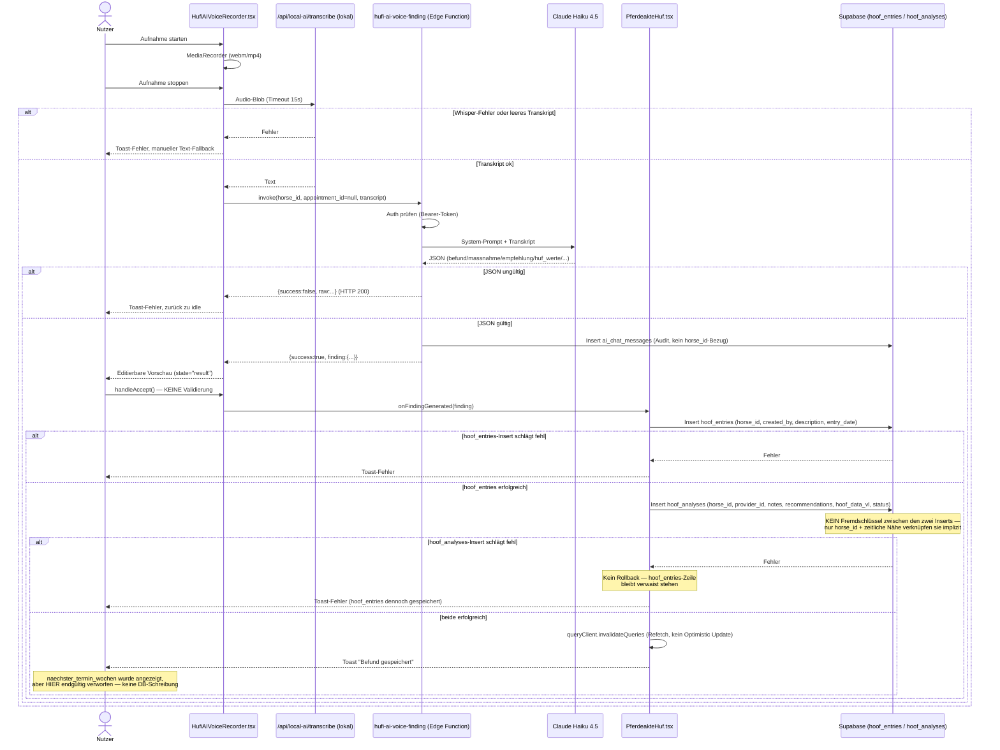

# Hufi Observation Workflow — Phase 1: Contracts & Policy

> Stand: 2026-08-02. Fortsetzung von `docs/hufi-observation-workflow-analysis.md`.
> Reine Contract-/Policy-Definition — keine Migration, keine echte
> Speicherung, keine UI-Änderung, kein Deployment. Alle Aussagen über
> lokale Dateien belegt (Quellcode, `supabase/migrations/*.sql`,
> generierte `types.ts`); keine Live-Datenbankabfrage.

---

## 1. Entscheidungen

Diese Runde klärt drei aus der vorigen Analyse offene Fragen abschließend
und leitet daraus die Contracts ab:

1. **`hufi_context_log` wird für den Observation-Flow nicht verwendet.**
   Begründung: Abschnitt 2.
2. **Mandantenbezug ist ausschließlich `provider_id`.** Kein
   `organizationId`-Feld in irgendeinem Contract. Begründung: Abschnitt 3.
3. **Speicherung als dedizierte PostgreSQL-RPC** statt Client-Inserts oder
   Edge-Function-Inserts. Begründung: Abschnitt 17.

Alle Contract-Feldnamen orientieren sich an den real existierenden
Tabellen/Prompt-Feldern (`hoof_entries`, `hoof_analyses`, der
`hufi-ai-voice-finding`-Extraktion) — keine neu erfundene Terminologie,
wo bestehende Namen fachlich passen (siehe Abschnitt 8 in
`docs/hufi-observation-workflow-analysis.md`, hier vertieft in
Abschnitt 6/8 unten).

---

## 2. `hufi_context_log`-Ergebnis

Vollständige Fundstellen (`grep -rn "hufi_context_log" src/ supabase/`,
6 Treffer, keine weiteren):

| Datei:Zeile | Zugriff | Zweck |
|---|---|---|
| `src/lib/hufi-actions.ts:102-113` (`executeHufiAction`) | Schreibt | Audit **vor** jeder KI-initiierten Aktion (EU-AI-Act) |
| `src/lib/hufi-brain.ts:424-434` (`learnFromInteraction`) | Schreibt | Lern-Feedback (`user_feedback`: confirmed/corrected/ignored) — **kein Audit-Zweck** |
| `src/lib/hufi-brain.ts:1096-1103` (`notifyColleague`) | Schreibt | Audit einer Kollegen-Benachrichtigung |
| `supabase/functions/delete-my-account/index.ts:89-90` | Löscht | DSGVO-Art.-17-Cleanup, kein fachlicher Nutzen |

**Es gibt keine einzige Lesestelle im gesamten Repository.** Bestätigt
durch `HUFI_ROADMAP.md:642`, wo "context_log auswerten" explizit im
"Parking Lot (Vision, nicht jetzt)" steht.

**Spalten** (`src/integrations/supabase/types.ts:9474-9484`):
`id, user_id, session_id, trigger, context_snapshot(jsonb), action_taken,
user_feedback, created_at`.

**Fachliche Einordnung**: Mischtyp aus Audit (`trigger`/`action_taken`/
`context_snapshot`) und Lernsignal (`user_feedback`) — kein `type`/
`category`-Feld trennt beide Zwecke sauber, nur freier Text in `trigger`.

**Herkunft**: keine Migration im Repo. Präzedenzfall vorhanden:
`supabase/migrations/20260509002234_hufi_memory_provenance.sql`
dokumentiert explizit, dass `hufi_memory`/`hufi_memories` per Dashboard
angelegt und nie migriert wurden. Für `hufi_context_log` fehlt eine
analoge Provenance-Migration; `docs/HUFI_MEMORY_SCHEMA_PROVENANCE.md`
listet sie nur mit "nicht bestätigt". **Naheliegend, aber nicht bewiesen**:
dieselbe Entstehungsart.

**Antwort**: Für den ersten MVP nicht erforderlich (nichts liest sie,
keine UI-Rolle). **Nicht als primäres Audit-Log für Beobachtungen
verwenden** — eigenes, migrationsgestütztes Audit-Feld in der neuen
Execution-Tabelle (Abschnitt 17) statt dieses ungeklärten Nebensystems.

---

## 3. Mandantenmodell

**Konzept 1** — `organizations` + `profiles.organization_id`/`org_role` +
`get_user_organization()`: **totes Gerüst**. `profiles.organization_id`
wird im gesamten Anwendungscode **nirgends gesetzt** (weder INSERT noch
UPDATE, verifiziert). Der zugehörige `auto_assign_organization`-Trigger
liest de facto immer `NULL`. Keine RLS-Policy auf `horses`/`appointments`/
`hoof_entries`/`hoof_analyses` nutzt `organization_id`.

**Konzept 2** — `organization_members` + `useOrganization.ts`: aktiv
genutzt, aber **strikt auf das B2B-Portal-Feature begrenzt**
(Versicherung/Schule/Shop-Whitelabel, Route `/portal/:slug`). Berührt
keinen Kern-Flow.

**Kreuzverifikation** (beide Konzepte): `horses.organization_id` existiert
als Spalte, aber ungenutzt in RLS (verwaist). `appointments.organization_id`
wird nur von `PortalCalendar.tsx` gelesen. `hoof_entries`, `hoof_analyses`,
`hufi_task_queue`, `hufi_followup_suggestions` haben **keinerlei**
Organisationsbezug — durchgängig `provider_id`/`user_id`-basiert. Keine
Brücke (Trigger/Sync) zwischen den beiden Konzepten gefunden.

**Antwort auf die Kernfragen**:
1. Solo-Provider (MVP): `provider_id = auth.uid()` reicht vollständig.
2. Mitarbeiter-Delegation: weder Konzept 1 noch 2 passt — das reale
   Muster ist `employee_profiles.provider_id`-Join, bereits als Vorbild in
   der `profiles`-RLS vorhanden (`20260305212804_...sql:54-60`), für
   Observations aber noch nicht gebaut. Kein MVP-Blocker.
3. `providerId` reicht als Mandantenfeld — kein `organizationId` in
   irgendeinem Contract.
4. Bestehender Schutz vor mandantenfremder Pferdezuordnung:
   `is_provider_for_horse(_provider_id, _horse_id)`
   (`20260306042520_...sql:3-24`) — SECURITY DEFINER, prüft
   `access_grants` bzw. Owner-Bezug. Für normale RLS-gebundene Inserts
   ausreichend; für eine neue RPC/Edge Function, die RLS potenziell
   umgeht, ist eine **explizite** Prüfung dieser Funktion zwingend
   (Referenz: `20260727120000_close_anon_secdef_leaks.sql`, dokumentiert
   genau diese Art Lücke als F-4: "auth.uid() IS NOT NULL ist keine
   Mandantentrennung").

---

## 4. Bestehende Voice-Pipeline

**Härtungs-Einstufung** (vollständige Tabelle):

| Komponente | Einstufung | Begründung |
|---|---|---|
| `HufiAIVoiceRecorder.tsx` (State-Maschine, Mic-Fallback) | wiederverwendbar | Sauberer Flow, robuster Fallback; Editier-States ohne Validierung |
| `/api/local-ai/transcribe` | produktiv nutzbar | DSGVO-konform lokal, Timeout+Fehlerbehandlung vorhanden |
| System-Prompt/JSON-Schema (`hufi-ai-voice-finding`) | wiederverwendbar | Gutes Extraktionsschema, aber ohne `confidence`, ohne Idempotenzschutz |
| JSON-Parsing/Fehlerbehandlung der Edge Function | muss gehärtet werden | Kein Schema-Validator, HTTP-200-bei-Fehler inkonsistent zu anderen Functions |
| `ai_chat_messages`-Audit-Insert | sollte ersetzt werden | Kein Bezug zu horse_id/finding, ungeeignet als Beobachtungs-Audit |
| `PferdeakteHuf.tsx` `handleFindingGenerated` | muss gehärtet werden | Kein FK zwischen den zwei Tabellen, kein Rollback, verwaiste Zeilen möglich |
| `appointmentId`-Parameter | muss gehärtet werden | Toter Parameter, immer `null` |
| `naechster_termin_wochen`-Weiterverarbeitung | unklar | Angezeigt, aber beim Speichern verworfen |
| `hufi_context_log` | nicht wiederverwenden | Siehe Abschnitt 2 |

---

## 5. Ziel-Datenfluss

`hoof_entries` bleibt der **führende**, menschenlesbare Verlaufseintrag —
er entsteht als **erster** Insert (wie heute). `hoof_analyses` folgt als
strukturierte Begleitzeile. Die beiden sind **heute nicht** über einen
Fremdschlüssel verbunden (nur `horse_id` + Zeitnähe) — dieser Bruch wird
in dieser Phase **nicht** repariert (keine Migration), aber die
Execution-Contract-Struktur (Abschnitt 10) ist so angelegt, dass ein
späteres `hoof_entry_id`-Feld auf `hoof_analyses` sich einfügen lässt, ohne
den Contract erneut zu brechen.

**Empfehlung für die nächste Bauphase**: eine dedizierte RPC
(`create_observation`, `SECURITY DEFINER`), die beide Inserts **in einer
Transaktion** ausführt, `is_provider_for_horse()` intern prüft, den
`idempotencyKey` gegen einen Unique-Index prüft und das Audit in einer
neuen, migrationsgestützten Tabelle schreibt. Details: Abschnitt 17.

---

## 6. Contract-Übersicht

| Datei | Zweck |
|---|---|
| `hufi-observation-input.ts` | Rohe Nutzereingabe + Seitenkontext |
| `hufi-observation-structure.ts` | Beobachtungsinhalt (Draft + Normalisiert) |
| `hufi-observation-followup.ts` | Optionale Folgekontrolle |
| `hufi-observation-proposal.ts` | KI-Vorschlag inkl. Pferd-Erkennung |
| `hufi-observation-confirmation.ts` | Nutzerentscheidung zum Vorschlag |
| `hufi-observation-execution.ts` | Nur serverseitig vertrauenswürdige Ausführungsdaten |
| `hufi-observation-result.ts` | Ergebnis nach Ausführung |
| `hufi-observation-error.ts` | 19 strukturierte Fehlercodes |
| `hufi-observation-policy.ts` | Policy-Matrix als Konfiguration |
| `index.ts` | Re-Export |

Alle unter `src/features/hufi-observation/contracts/` — Präzedenz durch
`src/features/email-marketing/*`, `@/features/...` bereits als
Import-Pfad genutzt (`MissionControl.tsx:93`). Zod bereits
Projektabhängigkeit (`^3.25.76`).

---

## 7. Feldvertrauen

| Feld | Herkunft | Client-geliefert | KI-generiert | Nutzer-bestätigt | Server-aufgelöst | Server-validiert | Persistierbar |
|---|---|---|---|---|---|---|---|
| `userId` (Input) | Client | ✓ | – | – | – | – | nein (nur Kontext) |
| `authenticatedUserId` (Execution) | — | – | – | – | ✓ (Session/JWT) | ✓ | ja |
| `providerId` (Input) | Client | ✓ | – | – | – | – | nein (nur Kontext) |
| `resolvedProviderId` (Execution) | — | – | – | – | ✓ | ✓ | ja |
| `horseId` (Confirmation → Execution) | Client-Auswahl | ✓ (Auswahl) | teilweise (Kandidaten) | ✓ | ✓ (re-autorisiert) | ✓ | ja |
| `appointmentId` | Client/Kontext | ✓ | – | optional | ✓ (falls gesetzt) | ✓ | ja |
| `observation` (Draft) | KI | – | ✓ | – | – | – | nein (nur Proposal) |
| `normalizedObservation` (Execution) | Nutzer+Server | – | Basis | ✓ | – | ✓ | ja |
| `confidence` | KI | – | ✓ | – | – | – | optional, nur zur Anzeige, nie als Autorisierungsgrundlage |
| `confirmationToken` | Server | – | – | – | ✓ (ausgestellt) | ✓ | ja (kurzlebig) |
| `idempotencyKey` | Client (generiert) | ✓ | – | – | – | ✓ (Unique-Check) | ja |

Kernregel (Auftrag): **KI-Ausgaben werden nie direkt persistiert** — der
Weg ist immer Proposal (KI) → Confirmation (Nutzer) → Execution (Server
löst `normalizedObservation` aus Proposal+Confirmation neu auf, übernimmt
nichts blind).

---

## 8. Horse Resolution

Sechs Zustände (`HorseResolutionStatusSchema`): `exact`, `contextual`,
`ambiguous`, `not_found`, `unauthorized`, `archived` — siehe
Kommentar in `hufi-observation-proposal.ts` für die genaue fachliche
Abgrenzung jedes Werts. `HorseCandidateSchema` ist bewusst
datenschutzarm (nur `owner.displayName`, keine Kontaktdaten), da die
Kandidatenliste vor jeder Autorisierungsprüfung an den Client zurückgeht.
`selectable:false` + `exclusionReason` erlaubt Transparenz ("dieses Pferd
wurde gefunden, aber du hast keinen Zugriff") ohne versehentlich einen
falschen Datensatz auswählbar zu machen.

---

## 9. Confirmation

Drei Entscheidungen: `confirm`/`edit`/`cancel`. Randfälle, die der
Contract über Felder abbildbar macht (Prüfung selbst ist serverseitige
Logik, nicht Teil der Zod-Validierung):

- **Abgelaufene Vorschau**: `confirmedAt` vs. `proposal.expiresAt` →
  `CONFIRMATION_EXPIRED`.
- **Veränderte Daten zwischen Vorschau und Bestätigung**:
  `proposalVersion` muss mit der serverseitig aktuell gültigen Version
  übereinstimmen → `PROPOSAL_CHANGED`.
- **Mehrfaches Bestätigen**: `confirmationId` + `idempotencyKey` (aus dem
  Input Contract) → `DUPLICATE_ACTION`.
- **Bearbeitung vor Bestätigung**: `decision="edit"` + `editedFields`
  (Partial des Observation-Drafts) hält fest, was geändert wurde, statt
  stillschweigend das Original zu überschreiben.

---

## 10. Execution

Enthält **ausschließlich** serverseitig aufgelöste/geprüfte Felder.
Zentrale Regel, im Code (`hufi-observation-execution.ts`) als Kommentar
verankert: `authenticatedUserId`/`resolvedProviderId`/`horseId` werden
IMMER neu aufgelöst bzw. re-autorisiert, nie aus dem Client-Payload
übernommen. `auditMetadata` trägt die EU-AI-Act-Begründungspflicht
(analog zum bestehenden `explanation`-Feld in `hufi-actions.ts`), aber
**nicht** über `hufi_context_log` (Abschnitt 2).

---

## 11. Result

`status`: `completed`/`partially_completed`/`failed` — der mittlere Wert
existiert explizit für den heute schon beobachteten Fall
"`hoof_entries` erfolgreich, `hoof_analyses` fehlgeschlagen". `reversible`
ist heute **immer `false`** (kein Undo-Muster im Schema), `undoToken` ist
für eine spätere Fähigkeit vorbereitet, ohne den Contract zu brechen.

---

## 12. Errors

19 Codes wie im Auftrag, siehe `hufi-observation-error.ts`. Jeder Code hat
Default-Werte für `retryable`/`recoverable`/`requiresUserAction`
(`HUFI_OBSERVATION_ERROR_DEFAULTS`) — z.B. `NETWORK_ERROR`/`STORAGE_FAILED`
sind `retryable:true`, `TENANT_MISMATCH`/`PERMISSION_DENIED` sind es
nicht. `userMessage` darf laut Kommentar im Schema nie interne Details
enthalten; `technicalMessage` ist der getrennte Kanal für Logs.

---

## 13. Follow-up

Zieltabelle für die *nächste* Bauphase: **`hufi_followup_suggestions`**
(nicht "`hufi_follow_ups`" — im Auftrag genannter Name existiert nicht,
korrigiert und verifiziert: `supabase/migrations/
20260715200000_hufi_followup_suggestions.sql`). Diese Tabelle wird heute
bereits vom `morning-briefing`-Cronjob befüllt — der Contract soll sie
wiederverwenden, nicht ersetzen. Regel: `enabled=true` verlangt **genau
eines** von `intervalDays`/`dueDate` (XOR, per `.refine()` durchgesetzt).
Kein Auto-Booking — ein Follow-up ist Aufgabe/Erinnerung, kein
Kalendereintrag.

---

## 14. Policies

Neun Aktionen in `HUFI_OBSERVATION_POLICIES`
(`hufi-observation-policy.ts`). Zusammenfassung der Risikoeinstufung:

| Aktion | Risiko | Bestätigung | Reversibel | Idempotent |
|---|---|---|---|---|
| create_observation_proposal | low | nein | ja | ja |
| resolve_horse_exact | low | nein | ja | ja |
| request_horse_selection | low | nein | ja | ja |
| **save_observation** | **high** | **ja** | nein | ja |
| create_follow_up | medium | ja | ja | ja |
| **overwrite_existing_observation** | **high** | **ja** | nein | **nein (offen)** |
| cancel_action | low | nein | ja | ja |
| retry_action | medium | nein | ja | ja |
| **undo_observation** | **high** | ja | ja | ja *(heute technisch nicht umsetzbar — kein Undo-Muster im Schema, im `note`-Feld dokumentiert)* |

Strukturregel, im Beispiel-Skript geprüft: **jede** Policy mit
`riskLevel:"high"` ist `auditable:true` UND `requiresConfirmation:true`.

---

## 15. Idempotenz

- **Erzeugung**: `idempotencyKey` wird **client-seitig** generiert (UUID
  oder vergleichbar eindeutiger String, min. 16 Zeichen) beim Erststart
  einer Beobachtungs-Eingabe (Input Contract) und über Proposal/
  Confirmation/Execution unverändert mitgeführt.
- **Gültigkeitsdauer**: bis die zugehörige Execution abgeschlossen
  (`completed`/`failed`) ist — danach kann derselbe Key für eine neue,
  fachlich andere Aktion nicht wiederverwendet werden (Unique-Constraint
  in der künftigen Execution-Tabelle, nicht Teil dieser Contract-Runde).
- **Scope**: pro `(resolvedProviderId, idempotencyKey)` — nicht global,
  da zwei verschiedene Provider theoretisch denselben Client-generierten
  Key erzeugen könnten (Kollisionswahrscheinlichkeit bei UUID
  vernachlässigbar, aber der Scope macht das explizit sicher statt sich
  auf Zufall zu verlassen).
- **Erneuter Submit**: zweiter Aufruf mit demselben Key innerhalb der
  Gültigkeitsdauer → `DUPLICATE_ACTION`, Server gibt das **Ergebnis der
  ersten Ausführung** zurück statt erneut zu schreiben (setzt voraus,
  dass das Result mit dem Key verknüpft gespeichert wird).
- **Netzwerk-Retry**: identisch zu "erneuter Submit" — aus Serversicht
  nicht unterscheidbar, das ist beabsichtigt (Retry-Sicherheit ist der
  Zweck des Mechanismus).
- **Teilweiser Schreibfehler**: siehe Transaktionsstrategie (Abschnitt 17)
  — mit einer RPC-Transaktion gibt es keinen Teilzustand, den ein Retry
  sehen könnte (entweder ganz oder gar nicht geschrieben).
- **Abgelaufene Bestätigung**: `idempotencyKey` bleibt gültig, aber die
  Ausführung wird verweigert (`CONFIRMATION_EXPIRED`) — der Nutzer muss
  einen neuen Proposal-Durchlauf starten, mit neuem Key.
- **Veränderte Proposal-Version**: `PROPOSAL_CHANGED` — auch hier bleibt
  der ursprüngliche Key "verbraucht", ein neuer Versuch braucht einen
  neuen Proposal-Durchlauf und damit einen neuen Key.

Diese Empfehlung erfindet **keinen** neuen Tabellenmechanismus in dieser
Runde — sie benennt nur, was der Schema-Recherche zufolge heute komplett
fehlt (kein `idempotency_key` irgendwo im Schema gefunden) und wie es sich
in das bestehende `provider_id`/RLS-Muster einfügen würde.

---

## 16. Autorisierung

Zehnstufiger Ablauf (wie im Auftrag), mit bestehenden Vorlagen:

1. **Authentifizierten Nutzer ermitteln** — `auth.uid()` innerhalb der
   RPC (Standardmuster, kein neues Konzept).
2. **Provider auflösen** — `has_role(auth.uid(), 'provider')`, bereits
   etabliertes Muster (`appointments`-RLS, `hoof_analyses`-RLS).
3. **Pferdezugriff prüfen** — `is_provider_for_horse(auth.uid(), horse_id)`
   (`20260306042520_...sql`) als direkte Vorlage.
4. **Terminzugriff prüfen** — analog, über `appointments.provider_id =
   auth.uid()`, falls `appointmentId` gesetzt ist.
5. **Proposal neu validieren** — Zod-Schema serverseitig erneut gegen die
   `normalizedObservation` anwenden (nicht nur clientseitig vertrauen).
6. **Confirmation Token prüfen** — Token muss zum `proposalId` passen und
   serverseitig ausgestellt worden sein.
7. **Idempotenz prüfen** — Unique-Check (Abschnitt 15).
8. **Schreibaktion ausführen** — RPC-Transaktion (Abschnitt 17).
9. **Audit schreiben** — neue, migrationsgestützte Tabelle, NICHT
   `hufi_context_log` (Abschnitt 2).
10. **Ergebnis zurückgeben** — `HufiObservationResultSchema`.

Bestes Vorbild für Audit-Disziplin bei Autorisierungsprüfungen:
`supabase/migrations/20260727120000_close_anon_secdef_leaks.sql` (am
gründlichsten dokumentierte Sicherheitsmigration im Repo, prüft explizit
gegen "Nullzweig als Mandantenschlupfloch").

---

## 17. Transaktionsstrategie

Bewertung der vier Optionen gegen die im Auftrag genannten Kriterien:

| Kriterium | A: Client-Inserts | B: Edge Function, mehrere Inserts | C: dedizierte RPC | D: Edge Function + RPC |
|---|---|---|---|---|
| Transaktionssicherheit | nein (heutiger Zustand, belegt: kein FK zwischen hoof_entries/hoof_analyses) | nein (mehrere `await`-Inserts über den JS-Client, kein `BEGIN/COMMIT`) | **ja** (native Postgres-Transaktion) | ja (über die RPC) |
| RLS | greift pro Insert einzeln | greift pro Insert einzeln | **eine** Stelle, klar prüfbar | eine Stelle |
| Autorisierung | nur RLS | nur RLS, außer explizit codiert | **RPC kann `is_provider_for_horse()` explizit + zusätzlich zur RLS prüfen** | wie C |
| Idempotenz | am schwersten (mehrere Schreibpunkte) | mittel | **am leichtesten (ein Unique-Check vor der Transaktion)** | wie C |
| Audit | müsste an jeder Stelle einzeln erfolgen | zentraler, aber zusätzlicher Netzwerk-Hop | **im selben Transaktionsblock** | zwei Hops |
| Wartbarkeit | am schwersten (Logik über UI verteilt) | mittel | **eine SQL-Funktion, versioniert wie jede Migration** | am komplexesten |
| Fehlerrückgabe | uneinheitlich (heute: Toast, kein Code) | strukturierbar | **strukturiert über Postgres-Exceptions → Contract-Fehlercodes** | strukturiert |
| Rollback | nein (heutiges Verhalten: verwaiste Zeile) | nein | **automatisch (Transaktion)** | automatisch |
| Offline-Verhalten | unverändert schlecht | unverändert | unverändert (kein Offline-Queueing in dieser Phase geplant) | unverändert |
| Entwicklungsaufwand | am geringsten | mittel | mittel | am höchsten |

**Empfehlung: C — dedizierte PostgreSQL-RPC.** Die KI-Extraktion (Aufruf
an Claude) bleibt in der bestehenden Edge Function
(`hufi-ai-voice-finding`, unverändert) — die neue RPC übernimmt
ausschließlich den **Ausführungsschritt nach der Bestätigung**, braucht
also keine externen API-Aufrufe und keinen Edge-Function-Umweg (Option D
wäre nur nötig, wenn die Ausführung selbst wieder einen KI-Aufruf
bräuchte — tut sie nicht). Damit ist C sowohl das sicherste als auch das
einfachere Modell, nicht nur ein Kompromiss.

---

## 18. Tests

Keine Testbibliothek im Projekt vorhanden (kein vitest/jest, kein
`npm test`-Skript, keine bestehenden `*.test.ts`-Dateien — verifiziert).
Da keine neue Abhängigkeit installiert werden darf, liegen die
geforderten Fälle als **typgeprüfte Beispiel-/Assertions-Skripte** unter
`src/features/hufi-observation/contracts/__examples__/` (README dort
erklärt die Einschränkung ausführlich):

- `input.examples.ts` — gültiger Text-/Voice-Input, fehlender `rawInput`,
  ungültige `source`, zu kurzer `idempotencyKey`.
- `proposal-and-followup.examples.ts` — alle sechs Horse-Resolution-
  Zustände, Follow-up mit `intervalDays`/`dueDate`/beiden (abgelehnt)/
  keinem (abgelehnt).
- `confirmation-and-execution.examples.ts` — confirm/edit/cancel,
  abgelaufene Bestätigung, doppelte Aktion, Tenant-Mismatch (als
  dokumentierte Prüffunktionen, da das serverseitige Logik ist), gültiges
  Execution-Objekt, **strukturelle Prüfung, dass Execution kein rohes
  `userId`/`providerId`-Feld akzeptiert**.
- `structure-error-and-policy.examples.ts` — fehlende Beobachtung wird
  normalisiert abgelehnt (aber im Draft toleriert), `hoofMeasurements`
  ohne `hoofPosition` abgelehnt, strukturierte Fehlerantwort, Policy
  „save_observation verlangt Bestätigung", Policy „Proposal verlangt noch
  keine Bestätigung/Speicherung", Konsistenzregel „jede Hochrisiko-Policy
  ist auditierbar und bestätigungspflichtig".

**Geprüft via `npx tsc --noEmit`** (siehe Abschnitt Prüfungen im
Abschlussbericht). Manuell ausführbar nur mit einem extern installierten
TS-Runner (nicht Teil dieses Projekts) — bewusst dokumentierte
Einschränkung statt stillschweigend übergangen.

---

## 19. Offene Entscheidungen

1. Soll die künftige Execution-Tabelle ein neues, generisches Audit-Log
   für **alle** künftigen Hufi-Aktionen werden, oder observation-
   spezifisch bleiben? (Diese Runde nimmt keine Migration vor, daher
   offen.)
2. Soll `hoof_analyses` in der nächsten Bauphase eine `hoof_entry_id`-
   Spalte bekommen (echte FK statt impliziter Verknüpfung)? Empfohlen,
   aber nicht in dieser Runde entschieden — betrifft eine bestehende,
   produktiv genutzte Tabelle.
3. Mitarbeiter-Delegation (`employee_profiles`-Join) — für den MVP nicht
   nötig, aber die Execution-Contract-Struktur (`resolvedProviderId`
   getrennt von `authenticatedUserId`) ist bereits so angelegt, dass sich
   das später einfügen ließe. Zeitpunkt der Umsetzung offen.
4. Soll `overwrite_existing_observation` (Policy mit `idempotent:false`)
   in der nächsten Phase eine eigene Versionsprüfung bekommen, oder aus
   dem MVP-Scope komplett gestrichen werden? Aktuell nur als Policy mit
   Warnhinweis vorbereitet, nicht spezifiziert.
5. `confidence` fehlt in der heutigen KI-Extraktion komplett — muss der
   Prompt in `hufi-ai-voice-finding` erweitert werden, oder wird
   `confidence` serverseitig heuristisch aus anderen Signalen (z.B.
   Anzahl `missingFields`) abgeleitet?

---

## 20. Genauer nächster Bauauftrag

**Empfehlung, abweichend vom im Auftrag vorgeschlagenen Standard-Schritt
— begründet:**

Der Auftrag schlägt als bevorzugte Richtung „Textbasierter produktiver
Observation-Proposal-Flow ohne echte Speicherung" vor. Das bleibt die
richtige *Größenordnung* für den nächsten Schritt, aber die Analyse zeigt
einen präziseren Zuschnitt: Der aufwändigste, unsicherste Teil ist nicht
die KI-Extraktion (existiert bereits, Abschnitt 4) und nicht das
Proposal-Rendering (kann auf `HufiChoiceCards.tsx`/
`HufiObservationPreview.tsx` aus dem Lab aufbauen), sondern die **echte
Pferdesuche mit Disambiguierung** — die existiert nirgends im Projekt
(weder als Komponente noch als Query-Funktion, siehe
`docs/hufi-observation-workflow-analysis.md` Abschnitt 13).

**Nächster Bauauftrag**: *"Echte Pferdesuche mit Disambiguierung + reiner
Proposal-Flow (Text zuerst), noch ohne Speicherung."* Konkret:
1. Eine wiederverwendbare Pferdesuch-Funktion/Hook, die
   `HorseResolutionStatusSchema`/`HorseCandidateSchema` aus dieser Runde
   tatsächlich befüllt (gegen echte `horses`-Daten, RLS-gebunden,
   `is_provider_for_horse()`-konform).
2. Textinput → `HufiObservationInputSchema` → (gemockte oder echte,
   aber noch nicht persistierende) KI-Extraktion → echte Pferdesuche →
   `HufiObservationProposalSchema` vollständig befüllt.
3. Vorschau-UI (auf Basis vorhandener Lab-Komponenten, aber mit echten
   Daten statt Mock-Szenarien) zeigt Mehrdeutigkeit/fehlende Felder an.
4. Bestätigung wird **simuliert** (Confirmation Contract wird erzeugt und
   geloggt, aber `save_observation` wird noch nicht ausgeführt) — deckt
   sich mit dem im Auftrag vorgeschlagenen Endpunkt "noch nicht in
   hoof_entries schreiben".

Erst danach (übernächste Phase): die RPC aus Abschnitt 17 und die echte
Speicherung. Diese Reihenfolge trennt sauber "kann Hufi das richtige
Pferd finden" (das eigentliche Risiko) von "kann Hufi sicher speichern"
(technisch klar, nur noch Fleißarbeit nach dieser Contract-Runde).
